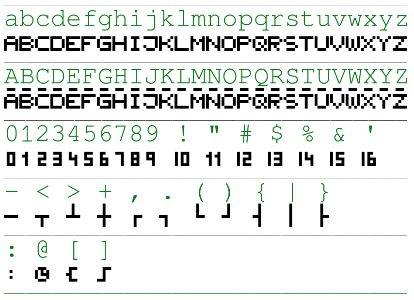

# Pixel-Font for Moeller Easy 'SPS' programmable Relais
Font was hand-painted in an Online-Font-Generator-Tool **BitFontMaker2**
- visit https://www.pentacom.jp/pentacom/bitfontmaker2/
- Copy/Paste [`Moeller_20220408.json`](Moeller_20220408.json) into Import-Dialog to this Online-Pixel-Editor
- Use orange button 'Build Font' to create [`Moeller.ttf`](Moeller.ttf) with setting "Letter Spacing: Monospace 11px" (or directly use this file here)
- Use font for e.g. documentation an planning on your PC

Note: Since july 2011, *Moeller* and *Eaton* merged.
Therefore the products are now named *Eaton easy* - though you still find a lot for *Moeller easy*

## Glyphs contained in the font (and mapping to typical glyphs)


the same characters as plain text:
```
abcdefghijklmnopqrstuvwxyz
ABCDEFGHIJKLMNOPQRSTUVWXYZ
0123456789 ! " # $ % & '
- < > + , . ( ) { | }
: @ [ ]
```

## Example usage: documentation in *LibreOffice Calc*

