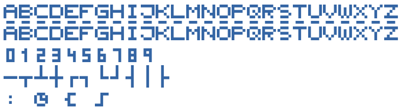
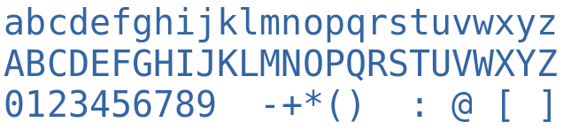
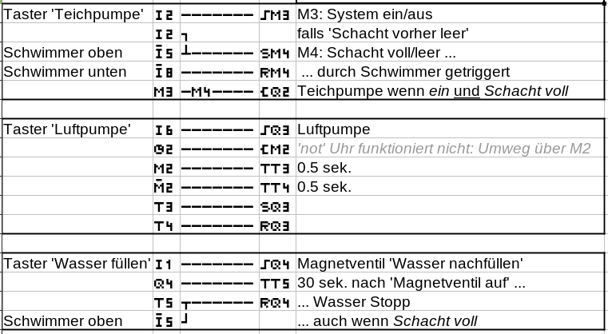

# Pixel-Font for Moeller Easy 'SPS' programmable Relais
Font was hand-painted in an Online-Font-Generator-Tool **BitFontMaker2**
- visit https://www.pentacom.jp/pentacom/bitfontmaker2/
- Copy/Paste [`Moeller_20220408.json`](Moeller_20220408.json) into Import-Dialog to this Online-Pixel-Editor
- Use orange button 'Build Font' to create [`Moeller.ttf`](Moeller.ttf) (or direcly use this file here)
- Use font for e.g. documentation an planning on your PC

Note: Since july 2011, *Moeller* and *Eaton* merged.
Therefore the products are now named *Eaton easy* - though you still find a lot for *Moeller easy*

## Glyphs contained in the font


compare with typical Glyphs at those code points:


the same characters as plain text:
```
abcdefghijklmnopqrstuvwxyz
ABCDEFGHIJKLMNOPQRSTUVWXYZ
0123456789
$%&+,.(){|}
: @ [ ]
```
### Character-Map
*but you already see all mappings in the pictures above*

| Char                       | Moeller-Glyph    |
|----------------------------|------------------|
| a-z                        | A-Z              |
| A-Z                        | A-Z *negation*   |
| 0-9                        | 0-9              |
| $ % & + , . ( ) { &#124; } | wire lines       |
| :                          | : *(jump mark)*  |
| @                          | clock            |
| [                          | Coil *Contactor* |
| ]                          | Coil *Impulse*   |
| *\<space>*                 | also *\<space>*  |

## Example usage: documentation in *LibreOffice Calc*

